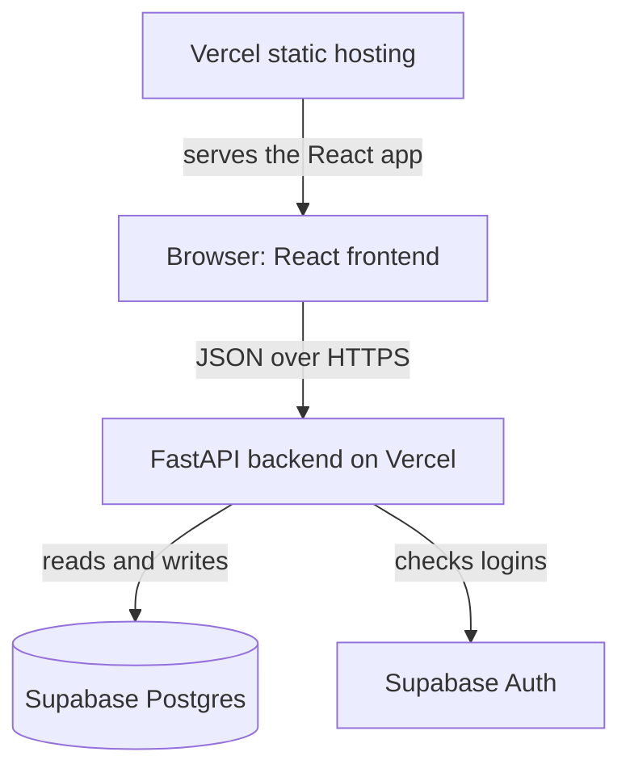

# Teacher Steve Monorepo Rebuild - Plan

## Goal Capsule

- **Objective:** Steve's students log in from any device and keep their vocabulary progress. The app runs at $0/month, and the maintainer (a Python developer) can run, change, and deploy every part of it.
- **Means:** Rebuild the repo as a monorepo. The existing React app becomes the frontend, a new FastAPI backend owns the data, Supabase stores the data and accounts, and Vercel hosts both parts. The work ships as a sequence of small PRs (see Delivery Sequence).
- **Product authority:** The maintainer decides scope and product behavior. Steve is the app's only teacher and its main user-side stakeholder. Porting the features beyond vocabulary is follow-on work, not active scope for this plan.
- **Open blockers:** None.

---

## Product Contract

### Summary

Teacher Steve becomes a monorepo: the existing React app as the frontend, talking to a new FastAPI backend, with accounts and progress stored in Supabase and both parts deployed on the free tiers of Vercel and Supabase. The first release is a thin slice, deployed end to end. Steve logs in, creates a student, and the student logs in and practices vocabulary, with progress saved on the server. The remaining features are ported one PR at a time after that.

### Problem Frame

The app has never had a backend. Everything it saves (students, progress, achievements, feedback) lives in the browser's localStorage. Data disappears when a student switches device or clears the browser. Progress, achievements, and streaks use global keys with no student ID, so two students on one browser share them.

Login is not real. The teacher login `Steve`/`2324` is hardcoded in code that ships to every browser. Students log in with a 4-digit code, which anyone on the internet can guess in minutes.

The repo holds two copies of the same app: a React/TypeScript app in `src/` and a single-file vanilla JavaScript app in `public/index.html`. More than twenty AI-generated report files sit at the repo root. Some describe features that do not exist in code, such as a content editor. The maintainer knows Python, not TypeScript, and wants to learn how a whole app is built and shipped. Nothing is live yet, so no users or data need migrating.

### Actors

- A1. Steve: the only teacher. Creates and manages student accounts and sees every student's progress.
- A2. Student: an English learner with an account Steve created. Practices activities and sees only their own progress.
- A3. Maintainer: the developer who owns the repo. Edits content files, merges PRs, and deploys. Resets Steve's password when needed.

### Key Decisions

- **JavaScript frontend plus a FastAPI JSON API.** This is the standard frontend/backend split, and games respond instantly in the browser. The maintainer accepts learning TypeScript/React to get it. Governs R4, R7. (session-settled: user-directed — chosen over FastAPI-rendered templates with HTMX and over keeping the single-file HTML app: standard two-part layout and instant-feeling games, accepting TypeScript/React upkeep)
- **Reuse the existing React app as the frontend.** It already covers every screen, so the thin slice is mostly backend work plus rewiring. Governs R4, R5. (session-settled: user-approved — chosen over a fresh React app ported screen by screen: fastest route to a deployed slice)
- **Thin slice first, then port features one at a time.** Deploying a small working version early teaches the whole pipeline before the bulk of the porting. Governs R6, R17, R18, R19. (session-settled: user-approved — chosen over full parity before launch and over permanently dropping the extras: teaches the whole pipeline early)
- **Steve issues each student a username and password.** No email sending is needed, so there is no email provider to set up. Governs R13, R14. (session-settled: user-approved — chosen over email invites or magic links and over longer class codes: no custom email provider needed)
- **Content lives in data files the maintainer edits.** It keeps the first version small. An in-app editor for Steve can come later. Governs R20, R21. (session-settled: user-approved — chosen over an in-app content editor for Steve: keeps the first version small)
- **Vercel Hobby and Supabase Free.** No money is involved, so Vercel Hobby's non-commercial rule is met. Governs R8. (session-settled: user-directed — chosen over paid hosting such as Vercel Pro after the non-commercial rule was shown: the app is free and the maintainer is unpaid)
- **FastAPI is the only path to server data.** Supabase could serve data straight to the browser. A Python backend is kept because the maintainer wants code they can maintain and learn from. Governs R7.
- **Vocabulary is the thin slice's one activity.** It already has flashcard, quiz, and matching modes in the React app. Governs R17, R20.
- **PRs land in the maintainer's order:** README and structure first, then the frontend, then the backend and later steps. Governs R22.

### Requirements

**Monorepo and docs**

- R1. The repo is a monorepo with the frontend and the FastAPI backend as separate top-level parts, each runnable locally with one documented command.
- R2. The README explains what Teacher Steve is, the stack, the repo layout, and how to run, test, and deploy each part, written so a Python developer new to JavaScript can follow it.
- R3. The repo root holds only the README and project-wide config, and the AI-generated report files (`*_COMPLETE.md`, `*_GUIDE.md`, `*_SUMMARY.md`, `*_REPORT.md`) no longer sit there.

**Frontend**

- R4. The existing React app in `src/` becomes the frontend, with its screens and look unchanged.
- R5. The single-file app in `public/index.html` is retired, since the React app already has every screen it has.
- R6. A feature not yet ported keeps saving to localStorage until its own PR moves it to the backend.

**Backend and hosting**

- R7. Data stored on the server is read and written only through the FastAPI backend, and the frontend never queries the database directly.
- R8. The frontend and backend deploy on Vercel Hobby with data in Supabase Free, and the project costs $0/month.
- R9. Every PR gets a preview deployment, and merging to `main` deploys to production.
- R10. Secrets such as Supabase keys live in environment settings, never in committed code.

**Accounts and login**

- R11. Steve has a real teacher account and is the only teacher.
- R12. No login credential appears anywhere in the frontend code, and the hardcoded `Steve`/`2324` login is gone.
- R13. Steve creates each student with a username and password and can reset a student's password.
- R14. Students log in with the username and password Steve gave them, and wrong credentials are refused.
- R15. Only Steve can create, edit, or delete students and see all students' progress, and a student sees only their own data.
- R16. Students cannot sign themselves up.

**Vocabulary progress (thin slice)**

- R17. Vocabulary practice saves each student's progress on the server, tied to that student.
- R18. A student who logs in on another device sees the same vocabulary progress.
- R19. Progress never leaks between students who share a browser.
- R20. Vocabulary content moves to a plain data file the maintainer edits, and each item has a stable ID that saved progress refers to.
- R21. Content for every other feature moves from TypeScript to data files in the same PR that ports that feature.

**Delivery**

- R22. The work ships as the PR sequence in Delivery Sequence, and every PR leaves the app runnable locally.

### Key Flows

- F1. Steve onboards a student
  - **Trigger:** A new student joins Steve's lessons.
  - **Actors:** A1, A2
  - **Steps:** Steve logs in, creates the student with a username and password, and gives the student those credentials.
  - **Outcome:** The student can log in from any device.
  - **Covered by:** R11, R13, R14, R16
- F2. Student practices vocabulary
  - **Trigger:** A student opens the app between lessons.
  - **Actors:** A2
  - **Steps:** The student logs in, opens vocabulary, and practices. Progress saves as they go. Later they log in on another device and continue.
  - **Outcome:** Progress is the same on every device.
  - **Covered by:** R14, R17, R18, R19
- F3. Maintainer changes content
  - **Trigger:** Steve asks for new or corrected vocabulary.
  - **Actors:** A3
  - **Steps:** The maintainer edits the vocabulary data file, opens a PR, checks the preview deployment, and merges.
  - **Outcome:** Production shows the new content, and existing progress on unchanged items stays intact.
  - **Covered by:** R9, R20

### Acceptance Examples

- AE1. **Covers R18.** Given a student finished a vocabulary set on a laptop, when they log in on a phone, then that set shows as finished.
- AE2. **Covers R19.** Given two students use the same browser, when the second logs in after the first logs out, then the second sees none of the first student's progress.
- AE3. **Covers R14.** Given a student enters a wrong password, when they submit, then login is refused and no student data loads.
- AE4. **Covers R15.** Given a student is logged in, when they try to open student management, then access is refused.
- AE5. **Covers R6.** Given the vocabulary PR has landed, when a student plays a game that is not yet ported, then it still works and saves to localStorage as before.
- AE6. **Covers R20.** Given a student has progress on a vocabulary item, when the maintainer fixes a typo in that item's definition, then the student's progress on it remains.

### Delivery Sequence

Each PR is small, reviewable, and leaves the app runnable (R22). Planning adds the files, tests, and verification for each one.

- **PR1. README and monorepo structure.** Delivers R2 and R3, and the layout part of R1. The README is rewritten, the folder layout for frontend and backend is in place, and the root report files are gone. App behavior is unchanged.
- **PR2. Frontend moves into the monorepo.** Delivers R4 and R5. The React app runs and builds from its new folder, still saving to localStorage. The single-file app is removed.
- **PR3. Backend skeleton and first deploy.** Delivers R8, R9, and R10, and the backend part of R1. A minimal FastAPI app runs locally and on Vercel next to the frontend. PRs get preview deployments, and the Supabase project is connected through environment settings.
- **PR4. Teacher and student accounts.** Delivers R11 through R16. Steve logs in with a real account, creates students and resets their passwords, and students log in with their own credentials. The hardcoded login is removed.
- **PR5. Vocabulary progress on the server.** Delivers R17 through R20. The thin slice is complete once this lands.
- **Follow-on PRs.** One PR per remaining feature area, each moving that feature to the backend and its content to data files (R6, R21). These are not active scope here. Each is planned when it comes up, and their order is still to be decided.

### Success Criteria

- A production URL on Vercel runs the thin slice (F1 and F2 end to end) at $0/month.
- Someone who clones the repo can run both parts locally by following only the README.
- The maintainer can explain and change every backend part without outside help.

### Scope Boundaries

**Deferred for later**

- Porting lessons, grammar, stories, tests, games, XP and levels, leaderboard, achievements and streaks, profiles, word of the day, fun facts, conversational roulette, dictionary, and feedback and bug reports.
- An in-app content editor for Steve.
- Email-based invites, magic links, and self-service password reset.

**Outside this product's identity**

- Payments or charging students, which would also break Vercel Hobby's non-commercial rule.
- More than one teacher.
- Migrating existing localStorage data, since nothing is live.

### Dependencies / Assumptions

- The app stays non-commercial. Vercel Hobby forbids commercial use, including charging students or paying someone to build or host the site. If that changes, the hosting moves to a paid plan first.
- Supabase Free pauses a project after 7 days without database activity. That is accepted: harmless during development, and a quiet week after launch means restoring the project from the Supabase dashboard.
- Supabase's built-in email sender only reaches the project team's addresses, at 2 emails per hour. No flow in this plan sends email. Steve's own password is reset by the maintainer through the Supabase dashboard.
- Students are general English learners, and Steve is the only teacher. The maintainer described the audience only as "an app to teach students English."
- The maintainer learns enough TypeScript/React to maintain the reused frontend.

### Outstanding Questions

**Resolve Before Planning**

- None.

**Deferred to Planning**

- Does the frontend sign in through Supabase Auth directly and pass the session to FastAPI, or does FastAPI handle login itself? Supabase Auth expects an email or phone number, so usernames may need mapping.
- Do the frontend and backend share one Vercel project or use two?
- Are the root report files archived in a folder or deleted, with git history keeping them?
- Which unused frontend dependencies are removed in PR2? Per the repo scan, `@supabase/supabase-js`, `@dnd-kit/*`, `framer-motion`, `canvas-confetti`, and `recharts` have no imports.
- Which checks (backend tests, frontend type check, lint) run automatically on each PR, and where?
- Does vocabulary content live on the backend and get served by the API, or stay bundled with the frontend build?

### Sources / Research

- Hardcoded teacher login: `src/components/LoginScreen.tsx:8-9`, `public/index.html:267`.
- 4-digit student codes: `src/utils/xpSystem.ts:183`, `public/index.html:642`, lookup at `src/components/LoginScreen.tsx:39-40`.
- Global, non-per-student storage keys: `src/utils/progress.ts:13`, `src/utils/achievements.ts:203`.
- Single storage helper in the single-file app: `public/index.html:634`.
- Placeholder test questions: `public/index.html:1658`.
- Admin screen is student management only: `src/components/HomePage.tsx:465-468`, `public/index.html:1197`. The content editor described in `REAL_TIME_EDITING_GUIDE.md` does not exist in code.
- Every screen in `public/index.html` has a React counterpart in `src/components/`. React also has Conversational Roulette, Fun Facts, and Word of the Day, which the single-file app lacks.
- Content modules: `src/data/*.ts`. Root `index.html` boots the React app via `/src/main.tsx`.
- Vercel Hobby non-commercial rule: https://vercel.com/docs/plans/hobby and https://vercel.com/docs/limits/fair-use-guidelines
- FastAPI on Vercel (zero-config, one function): https://vercel.com/docs/frameworks/backend/fastapi
- Supabase Free pausing and limits: https://supabase.com/docs/guides/platform/free-project-pausing and https://supabase.com/pricing
- Supabase email sending limits: https://supabase.com/docs/guides/auth/auth-smtp
