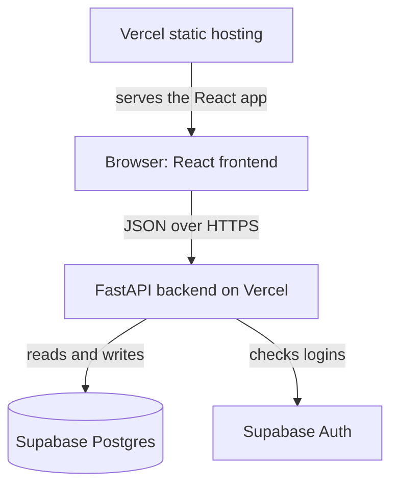

# Teacher Steve Monorepo Rebuild - Plan

## Goal Capsule

- **Objective:** Steve's students log in from any device and keep their vocabulary progress. The app runs at $0/month, and the maintainer (a Python developer) can run, change, and deploy every part of it.
- **Means:** Rebuild the repo as a monorepo. The existing React app becomes the frontend, a new FastAPI backend owns the data, Supabase stores the data and accounts, and Vercel hosts both parts. The work ships as a sequence of small PRs (see Delivery Sequence).
- **Product authority:** The maintainer decides scope and product behavior. Steve is the app's only teacher and its main user-side stakeholder. Porting the features beyond vocabulary is follow-on work, not active scope for this plan.
- **Execution scope:** The active units are U4 through U7, which deliver PR2 (GitHub issue #3). U1 through U3 delivered PR1 in GitHub PR #2. PR3 through PR5 get their units when each one is planned.
- **Stop conditions:** Stop when PR2's Definition of Done holds, and do not start PR3 work. Stop and ask if a PR2 unit seems to need a content change under `src/`, a version change to a kept package, or a config edit beyond the package name. Also stop and ask if the JavaScript bundle's contents differ from `main`'s, the CSS loses a class that `frontend/src/` uses, or the lock file changes beyond what U6's Verification expects.
- **Ships:** The maintainer opens PR2 against `main` on `steve-pixel24/Teacher_Steve`, closing issue #3, and merges it after review.
- **Open blockers:** None.

---

## Product Contract

### Summary

Teacher Steve becomes a monorepo: the existing React app as the frontend, talking to a new FastAPI backend, with accounts and progress stored in Supabase and both parts deployed on the free tiers of Vercel and Supabase. The first release is a thin slice, deployed end to end. Steve logs in, creates a student, and the student logs in and practices vocabulary, with progress saved on the server. The remaining features are ported one PR at a time after that.

Implementation planning covers PR1 and PR2. In PR1 the README is rewritten to describe the repo as it stands, the root report files move to `docs/legacy/`, and `frontend/` and `backend/` exist as placeholder folders. In PR2 the React app moves into `frontend/` and runs from there, the single-file app and every unused package go, and the READMEs follow the new layout. PR3 through PR5 are planned when each comes up.

### Problem Frame

The app has never had a backend. Everything it saves (students, progress, achievements, feedback) lives in the browser's localStorage. Data disappears when a student switches device or clears the browser. Progress, achievements, and streaks use global keys with no student ID, so two students on one browser share them.

Login is not real. The teacher login `Steve`/`2324` is hardcoded in code that ships to every browser. Students log in with a 4-digit code, which anyone on the internet can guess in minutes.

The repo holds two copies of the same app: a React/TypeScript app in `src/` and a single-file vanilla JavaScript app in `public/index.html`. More than twenty AI-generated report files sit at the repo root. Some describe features that do not exist in code, such as a content editor. The maintainer knows Python, not TypeScript, and wants to learn how a whole app is built and shipped. Nothing is live yet, so no users or data need migrating.

### Actors

- A1. Steve: the only teacher. Creates and manages student accounts and sees every student's progress.
- A2. Student: an English learner with an account Steve created. Practices activities and sees only their own progress.
- A3. Maintainer: the developer who owns the repo. Edits content files, merges PRs, and deploys. Resets Steve's password when needed.

### Key Decisions

- **JavaScript frontend plus a FastAPI JSON API.** This is the standard frontend/backend split, and games respond instantly in the browser. The maintainer accepts learning TypeScript/React to get it. Governs R4, R7. (session-settled: user-directed — chosen over FastAPI-rendered templates with HTMX and over keeping the single-file HTML app: standard two-part layout and instant-feeling games, accepting TypeScript/React upkeep)
- **Reuse the existing React app as the frontend.** It already covers every screen, so the thin slice is mostly backend work plus rewiring. Governs R4, R5. (session-settled: user-approved — chosen over a fresh React app ported screen by screen: fastest route to a deployed slice)
- **Thin slice first, then port features one at a time.** Deploying a small working version early teaches the whole pipeline before the bulk of the porting. Governs R6, R17, R18, R19. (session-settled: user-approved — chosen over full parity before launch and over permanently dropping the extras: teaches the whole pipeline early)
- **Steve issues each student a username and password.** No email sending is needed, so there is no email provider to set up. Governs R13, R14. (session-settled: user-approved — chosen over email invites or magic links and over longer class codes: no custom email provider needed)
- **Content lives in data files the maintainer edits.** It keeps the first version small. An in-app editor for Steve can come later. Governs R20, R21. (session-settled: user-approved — chosen over an in-app content editor for Steve: keeps the first version small)
- **Vercel Hobby and Supabase Free.** No money is involved, so Vercel Hobby's non-commercial rule is met. Governs R8. (session-settled: user-directed — chosen over paid hosting such as Vercel Pro after the non-commercial rule was shown: the app is free and the maintainer is unpaid)
- **FastAPI is the only path to server data.** Supabase could serve data straight to the browser. A Python backend is kept because the maintainer wants code they can maintain and learn from. Governs R7.
- **Vocabulary is the thin slice's one activity.** It already has flashcard, quiz, and matching modes in the React app. Governs R17, R20.
- **PRs land in the maintainer's order:** README and structure first, then the frontend, then the backend and later steps. Governs R22.



### Requirements

**Monorepo and docs**

- R1. The repo is a monorepo with the frontend and the FastAPI backend as separate top-level parts, each runnable locally with one documented command.
- R2. The README explains what Teacher Steve is, the stack, the repo layout, and how to run, test, and deploy each part, written so a Python developer new to JavaScript can follow it.
- R3. The repo root holds only the README and project-wide config, and the AI-generated report files (`*_COMPLETE.md`, `*_GUIDE.md`, `*_SUMMARY.md`, `*_REPORT.md`) no longer sit there.

**Frontend**

- R4. The existing React app in `src/` becomes the frontend, with its screens and look unchanged.
- R5. The single-file app in `public/index.html` is retired, since the React app already has every screen it has.
- R6. A feature not yet ported keeps saving to localStorage until its own PR moves it to the backend.

**Backend and hosting**

- R7. Data stored on the server is read and written only through the FastAPI backend, and the frontend never queries the database directly.
- R8. The frontend and backend deploy on Vercel Hobby with data in Supabase Free, and the project costs $0/month.
- R9. Every PR gets a preview deployment, and merging to `main` deploys to production.
- R10. Secrets such as Supabase keys live in environment settings, never in committed code.

**Accounts and login**

- R11. Steve has a real teacher account and is the only teacher.
- R12. No login credential appears anywhere in the frontend code, and the hardcoded `Steve`/`2324` login is gone.
- R13. Steve creates each student with a username and password and can reset a student's password.
- R14. Students log in with the username and password Steve gave them, and wrong credentials are refused.
- R15. Only Steve can create, edit, or delete students and see all students' progress, and a student sees only their own data.
- R16. Students cannot sign themselves up.

**Vocabulary progress (thin slice)**

- R17. Vocabulary practice saves each student's progress on the server, tied to that student.
- R18. A student who logs in on another device sees the same vocabulary progress.
- R19. Progress never leaks between students who share a browser.
- R20. Vocabulary content moves to a plain data file the maintainer edits, and each item has a stable ID that saved progress refers to.
- R21. Content for every other feature moves from TypeScript to data files in the same PR that ports that feature.

**Delivery**

- R22. The work ships as the PR sequence in Delivery Sequence, and every PR leaves the app runnable locally.

### Key Flows

- F1. Steve onboards a student
  - **Trigger:** A new student joins Steve's lessons.
  - **Actors:** A1, A2
  - **Steps:** Steve logs in, creates the student with a username and password, and gives the student those credentials.
  - **Outcome:** The student can log in from any device.
  - **Covered by:** R11, R13, R14, R16
- F2. Student practices vocabulary
  - **Trigger:** A student opens the app between lessons.
  - **Actors:** A2
  - **Steps:** The student logs in, opens vocabulary, and practices. Progress saves as they go. Later they log in on another device and continue.
  - **Outcome:** Progress is the same on every device.
  - **Covered by:** R14, R17, R18, R19
- F3. Maintainer changes content
  - **Trigger:** Steve asks for new or corrected vocabulary.
  - **Actors:** A3
  - **Steps:** The maintainer edits the vocabulary data file, opens a PR, checks the preview deployment, and merges.
  - **Outcome:** Production shows the new content, and existing progress on unchanged items stays intact.
  - **Covered by:** R9, R20

### Acceptance Examples

- AE1. **Covers R18.** Given a student finished a vocabulary set on a laptop, when they log in on a phone, then that set shows as finished.
- AE2. **Covers R19.** Given two students use the same browser, when the second logs in after the first logs out, then the second sees none of the first student's progress.
- AE3. **Covers R14.** Given a student enters a wrong password, when they submit, then login is refused and no student data loads.
- AE4. **Covers R15.** Given a student is logged in, when they try to open student management, then access is refused.
- AE5. **Covers R6.** Given the vocabulary PR has landed, when a student plays a game that is not yet ported, then it still works and saves to localStorage as before.
- AE6. **Covers R20.** Given a student has progress on a vocabulary item, when the maintainer fixes a typo in that item's definition, then the student's progress on it remains.

### Delivery Sequence

Each PR is small, reviewable, and leaves the app runnable (R22). Planning adds the files, tests, and verification for each one.

- **PR1. README and monorepo structure.** Delivers R2, the report-file part of R3, and the layout part of R1. The README is rewritten, the folder layout for frontend and backend is in place, and the root report files are gone. App behavior is unchanged.
- **PR2. Frontend moves into the monorepo.** Delivers R4 and R5, and completes R3 once the frontend's files leave the root. The React app runs and builds from its new folder, still saving to localStorage. The single-file app is removed.
- **PR3. Backend skeleton and first deploy.** Delivers R8, R9, and R10, and the backend part of R1. A minimal FastAPI app runs locally and on Vercel next to the frontend. PRs get preview deployments, and the Supabase project is connected through environment settings.
- **PR4. Teacher and student accounts.** Delivers R11 through R16. Steve logs in with a real account, creates students and resets their passwords, and students log in with their own credentials. The hardcoded login is removed.
- **PR5. Vocabulary progress on the server.** Delivers R17 through R20. The thin slice is complete once this lands.
- **Follow-on PRs.** One PR per remaining feature area, each moving that feature to the backend and its content to data files (R6, R21). These are not active scope here. Each is planned when it comes up, and their order is still to be decided.

### Success Criteria

- A production URL on Vercel runs the thin slice (F1 and F2 end to end) at $0/month.
- Someone who clones the repo can run both parts locally by following only the README.
- The maintainer can explain and change every backend part without outside help.

### Scope Boundaries

**Deferred for later**

- Porting lessons, grammar, stories, tests, games, XP and levels, leaderboard, achievements and streaks, profiles, word of the day, fun facts, conversational roulette, dictionary, and feedback and bug reports.
- An in-app content editor for Steve.
- Email-based invites, magic links, and self-service password reset.

**Outside this product's identity**

- Payments or charging students, which would also break Vercel Hobby's non-commercial rule.
- More than one teacher.
- Migrating existing localStorage data, since nothing is live.

**Deferred to Follow-Up Work**

- PR3 (GitHub issue #4):
  - Python, virtualenv, and `.env` entries in `.gitignore`, which is also the time to drop its unused `.next/` and `build/` entries.
  - Automatic checks on PRs, with `frontend/` as the frontend's working directory.
  - The Node version Vercel builds with, for example through `engines` in `frontend/package.json` (KTD8).
  - The README's backend and deploy sections.
- Unpublishing the GitHub Pages site, a manual step outside any PR (see Operational Notes).

### Dependencies / Assumptions

- The app stays non-commercial. Vercel Hobby forbids commercial use, including charging students or paying someone to build or host the site. If that changes, the hosting moves to a paid plan first.
- Supabase Free pauses a project after 7 days without database activity. That is accepted: harmless during development, and a quiet week after launch means restoring the project from the Supabase dashboard.
- Supabase's built-in email sender only reaches the project team's addresses, at 2 emails per hour. No flow in this plan sends email. Steve's own password is reset by the maintainer through the Supabase dashboard.
- Students are general English learners, and Steve is the only teacher. The maintainer described the audience only as "an app to teach students English."
- The maintainer learns enough TypeScript/React to maintain the reused frontend.

### Outstanding Questions

**Resolve Before Planning**

- None.

**Deferred to Planning**

- Does the frontend sign in through Supabase Auth directly and pass the session to FastAPI, or does FastAPI handle login itself? Supabase Auth expects an email or phone number, so usernames may need mapping. If the frontend signs in through Supabase Auth, PR4 adds `@supabase/supabase-js` back, since PR2 removes it (KTD7). (resolve in PR4)
- Do the frontend and backend share one Vercel project or use two? (resolve in PR3)
- Which checks (backend tests, frontend type check, lint) run automatically on each PR, and where? (resolve in PR3)
- Does vocabulary content live on the backend and get served by the API, or stay bundled with the frontend build? (resolve in PR5)

### Sources / Research

- Hardcoded teacher login: `src/components/LoginScreen.tsx:8-9`, `public/index.html:267`.
- 4-digit student codes: `src/utils/xpSystem.ts:183`, `public/index.html:642`, lookup at `src/components/LoginScreen.tsx:39-40`.
- Global, non-per-student storage keys: `src/utils/progress.ts:13`, `src/utils/achievements.ts:203`.
- Single storage helper in the single-file app: `public/index.html:634`.
- Placeholder test questions: `public/index.html:1658`.
- Admin screen is student management only: `src/components/HomePage.tsx:465-468`, `public/index.html:1197`. The content editor described in `REAL_TIME_EDITING_GUIDE.md` (moved to `docs/legacy/` in PR1) does not exist in code.
- Every screen in `public/index.html` has a React counterpart in `src/components/`. React also has Conversational Roulette, Fun Facts, and Word of the Day, which the single-file app lacks.
- Content modules: `src/data/*.ts`. Root `index.html` boots the React app via `/src/main.tsx`.
- Vercel Hobby non-commercial rule: https://vercel.com/docs/plans/hobby and https://vercel.com/docs/limits/fair-use-guidelines
- FastAPI on Vercel (zero-config, one function): https://vercel.com/docs/frameworks/backend/fastapi
- Vercel monorepos (one project per folder via Root Directory): https://vercel.com/docs/monorepos
- Supabase Free pausing and limits: https://supabase.com/docs/guides/platform/free-project-pausing and https://supabase.com/pricing
- Supabase email sending limits: https://supabase.com/docs/guides/auth/auth-smtp
- The paths above predate PR2. From PR2 on, `src/`, `index.html`, and the root config files live under `frontend/`, and `public/index.html` exists only in git history (`git show 3899655:public/index.html`).

---

## Planning Contract

**Product Contract preservation:** no scope change. Edits made while planning PR1:

- Delivery Sequence: R3 now lands across PR1 (report files leave the root) and PR2 (the frontend's files leave the root), because the React app stays at the root until PR2 moves it.
- Outstanding Questions: KTD2 resolves the report-files question, so it was removed. Each remaining deferred question names the PR that resolves it.
- Summary, Scope Boundaries, and Sources gained PR1 lines.

Edits made while planning PR2, also with no scope change:

- Summary gained a PR2 sentence.
- Scope Boundaries: the PR2 follow-up line was removed, because U4 through U7 now own that work. The PR3 line gained the items PR2 hands forward.
- Outstanding Questions: KTD7 resolves the dependency question, so it was removed. The PR4 auth question notes the package KTD7 removes.
- Sources gained a line saying its paths predate PR2.

### Key Technical Decisions

- KTD1. **Top-level `frontend/` and `backend/` folders, each holding a placeholder README until its PR fills it.** Git does not track empty folders, and a README tells a reader what the folder is for, which a `.gitkeep` cannot. The layout keeps PR3's one-or-two-Vercel-projects question open: Vercel creates one project per folder through its Root Directory setting, and a single project can reach a FastAPI app under `backend/` through `tool.vercel.entrypoint` in `pyproject.toml` (Vercel monorepos and FastAPI docs in Sources). Serves R1. (session-settled: user-approved — chosen over `apps/web` and `apps/api`: plain names are easier to follow for a Python developer new to JavaScript)
- KTD2. **Move the 23 root report files, unchanged, to `docs/legacy/`.** That clears them from the root (R3) while keeping them in the tree for reference. A short `docs/legacy/README.md` says they are pre-rebuild AI-generated reports that don't describe the current code, because several describe features that don't exist, such as the content editor in `REAL_TIME_EDITING_GUIDE.md`. Ten of them print the hardcoded teacher login, which is already public in `src/components/LoginScreen.tsx` and in this plan until PR4 replaces it. Serves R3. (session-settled: user-directed — chosen over deleting them outright: the maintainer wants them kept in the repo for reference)
- KTD3. **The README describes the repo as it is after the PR that last changed it.** The report files went wrong by describing features that did not exist. So the README labels anything not built yet (backend, database, deploy, automated tests) as planned and links to Delivery Sequence instead of documenting it. Each later PR updates the README sections for what it adds. Serves R2, R22.
- KTD4. **The README names the file holding the hardcoded teacher login instead of printing the login.** The repo is public and PR4 removes the credential (R12), so the README should not add a second copy. Serves R12.
- KTD5. **GitHub Pages stays out of PR1's diff.** The repo's Pages site at `https://steve-pixel24.github.io/Teacher_Steve/` still serves a 2026-09-25 deployment of the unbuilt root `index.html`, which renders a blank page. A Pages workflow was added to `main` and then deleted, so no file in the repo controls the site. (session-settled: user-approved — chosen over folding the takedown into PR1: it is a setting on Steve's repo, not a file change)
- KTD6. **`frontend/` is a self-contained npm project, and the root has no `package.json`.** Every npm command runs from inside `frontend/`, so `npm run dev` at the repo root stops working. npm workspaces or root scripts that forward to `frontend/` would put JavaScript config back at the root, which R3 rules out, and the backend is Python, so a workspace would link nothing. A folder that holds its own `package.json` and lock file also fits the Vercel Root Directory option PR3 may pick (KTD1). Serves R1, R3, R4. (session-settled: user-approved — chosen over a root `package.json` with npm workspaces or forwarding scripts: the root keeps only the README and project-wide config)
- KTD7. **Remove every package the app doesn't import, `@supabase/supabase-js` included.** `src/`, `index.html`, `vite.config.js`, and `src/index.css` import only `react`, `react-dom`, and the build tools. Keep these nine and remove the rest:

  | Keep | Remove |
  |---|---|
  | `react`, `react-dom` | `@dnd-kit/core`, `@dnd-kit/sortable`, `@dnd-kit/utilities` |
  | `vite`, `@vitejs/plugin-react` | `@supabase/supabase-js` |
  | `tailwindcss`, `@tailwindcss/vite` | `canvas-confetti`, `@types/canvas-confetti` |
  | `typescript`, `@types/react`, `@types/react-dom` | `date-fns`, `framer-motion`, `lucide-react`, `react-router-dom`, `recharts` |
  | | `uuid`, `@types/uuid` |

  Supabase goes too, because R7 sends server data through FastAPI and PR4 has not decided whether the frontend talks to Supabase Auth. If PR4 decides it should, adding the package back is one install. Keeping it unused would leave the README describing a package the app doesn't use (KTD3). Serves R4. (session-settled: user-approved — chosen over keeping `@supabase/supabase-js` until PR4 decides the login route: PR4 can add it back with one install)
- KTD8. **The README keeps "Node 22 or newer", for a new reason, and PR2 adds no Node version to config.** Once the `@supabase/*` packages go, the remaining packages need Node 20 or newer (`@tailwindcss/oxide`). On Linux x64 only, Rollup's optional helper `@napi-rs/lzma-linux-x64-gnu` asks for `^22.20 || ^24.12 || >=25`, so npm warns on earlier 22.x releases there but still installs. Node 20 reached end-of-life on 2026-04-30, so 22 is the oldest Node line still supported. Recording the version in config, through `engines` in `frontend/package.json` or an `.nvmrc`, is how Vercel picks its Node version, so PR3 decides it together with the Vercel setup. Serves R2. (session-settled: user-approved — chosen over adding `engines` to `frontend/package.json` in PR2: PR3 sets the Node version together with Vercel)

### Output Structure

The repo after PR2. Anything not listed is unchanged.

```text
README.md                   run steps now start in frontend/ (U7)
.gitignore                  unchanged; its node_modules/ and dist/ patterns already match inside frontend/
docs/plans/                 this plan
docs/legacy/                the 23 former root reports plus a README (U1)
frontend/README.md          placeholder from U2, rewritten (U7)
frontend/index.html         moved from the root, unchanged (U5)
frontend/src/               moved from the root, unchanged (U5)
frontend/tsconfig.json      moved from the root, unchanged (U5)
frontend/vite.config.js     moved from the root, unchanged (U5)
frontend/package.json       moved (U5); unused packages removed and the name replaced (U6)
frontend/package-lock.json  moved (U5); updated by the removals (U6)
backend/README.md           placeholder from U2, unchanged; the FastAPI app arrives in PR3
```

`public/index.html` is deleted (U4), and no app file remains at the root.

### Sequencing

- PR1 starts from `origin/main`, not from the local branch `conditionals--probability---modals-d4bea`. That branch belongs to the already-merged PR #1, and `origin/main` has five commits it lacks. The two trees differ only by this plan file, so PR1 carries this plan file as well.
- PR1's units land in the order U1, U2, U3, because U3 describes the layout that U1 and U2 produce.
- PR2 branches from `main` at or after `3899655`, the merge of GitHub PR #2.
- PR2's units land in the order U4, U5, U6, U7:
  1. U4 goes first, so the move carries no file that is about to be deleted.
  2. U5 lands as its own commit of pure moves, so git records renames and `git log --follow` keeps the history of `src/`. PR1 deleted the reports and re-added them in separate commits, so their history no longer follows them. Editing `package.json` in the same commit could drop it below git's rename-detection threshold.
  3. U6 follows the move, so npm updates the lock file in its new place.
  4. U7 goes last, because it describes the result.

### Operational Notes

- **Unpublish the GitHub Pages site (manual, repo admin).** An admin of `steve-pixel24/Teacher_Steve` unpublishes the site from the repository's Pages settings on GitHub (KTD5). As of 2026-09-30 the site is still published. GitHub's Pages API reports it built and public, with a workflow as its source, and no workflow file exists, so merging PR2 does not redeploy it. Issue #4 tracks the takedown before PR3's first Vercel deploy, which leaves the app with one public URL. Unpublish rather than switch the source: after PR2 there is no root `index.html`, so a branch-based Pages build would publish `README.md` as the site.
- **Existing clones after PR2 (PR description).** PR2's description tells anyone with an existing clone to do three things:
  1. Stop the dev server before pulling. `strictPort` blocks a second server on port 3000.
  2. Delete the root `node_modules/` and `dist/`. Git ignores them, so they survive the pull, and npm, Node, TypeScript, and Tailwind look for packages in parent folders. A stale root `node_modules/` can make `frontend/` seem to work without an install.
  3. Run `npm install` in `frontend/`.
- **One intended dev-server change (PR description).** On `main`, opening `http://localhost:3000/index.html` directly serves the old single-file app from `public/`, while `/` serves React. After U4 both serve the React app.
- **localStorage survives the move.** The dev server keeps the origin `http://localhost:3000`, so data saved before PR2 is still there. Compare `main` and PR2 one after the other on port 3000. Running them side by side on two ports puts them on two origins, and the second one starts empty.

---

## Implementation Units

U1 through U3 delivered PR1 and describe the repo as it stood then. U4 through U7 deliver PR2.

### U1. Move the root report files to `docs/legacy/`

- **Goal:** The repo root holds no AI-generated report files, and the reports stay available under `docs/legacy/`.
- **Requirements:** R3 (report-file part, per Delivery Sequence), KTD2.
- **Dependencies:** None.
- **Files:** Move every root-level `.md` file except `README.md` into `docs/legacy/`. These are the 23 files matching `*_COMPLETE.md`, `*_GUIDE.md`, `*_SUMMARY.md`, and `*_REPORT.md`. Create `docs/legacy/README.md`.
- **Approach:** Move the files with their content unchanged (KTD2), and add a short `docs/legacy/README.md` saying they don't describe the current code. Nothing in `src/`, `public/`, or the root config files references them.
- **Test expectation:** none -- documentation move with no code or behavior change.
- **Verification:** `README.md` is the only `.md` file at the repo root, and `docs/legacy/` holds all 23 files byte-identical to their originals plus its README.

### U2. Add the `frontend/` and `backend/` folders

- **Goal:** The monorepo's two top-level parts exist as folders, and each one says what it will hold.
- **Requirements:** R1 (layout part), KTD1.
- **Dependencies:** None.
- **Files:** Create `frontend/README.md` and `backend/README.md`.
- **Approach:**
  1. `frontend/README.md` says the React app will live here, that it runs from the repo root until the Delivery Sequence step that moves it, and links to the root `README.md` for run instructions.
  2. `backend/README.md` says the FastAPI backend will live here and links to the Delivery Sequence step that adds it.
  3. Keep each to a few lines, with relative links so they work both on GitHub and locally.
  4. Add nothing else to either folder. `tsconfig.json` includes only `src`, and Vite builds from the root `index.html`, so neither tool picks up the new files.
- **Test expectation:** none -- placeholder docs only.
- **Verification:** Both folders show on GitHub with their README rendered, both relative links resolve, and the app still installs, runs, and builds from the root as before (Verification Contract).

### U3. Rewrite the root README

- **Goal:** Someone who clones the repo, including a Python developer new to JavaScript, understands what Teacher Steve is and can run the frontend by following only the README.
- **Requirements:** R2, KTD3, KTD4. Covers the frontend half of the Success Criterion about running both parts from the README alone. PR3 adds the backend half.
- **Dependencies:** U1, U2.
- **Files:** Modify `README.md`.
- **Approach:** Replace the current two-line README with these sections, in this order:
  1. **What it is:** an English-learning app for Steve's students (vocabulary, grammar, stories, tests, and games), plus a teacher screen for managing students.
  2. **Status:** frontend only. Everything saves to the browser's localStorage. There is no backend or database yet, and nothing is deployed. Link to Delivery Sequence for what comes next.
  3. **Stack:** today, React 18, TypeScript 5, Vite 6, and Tailwind CSS 4 (from `package.json`). FastAPI, Supabase, and Vercel appear too, each labeled as planned.
  4. **Repo layout:** the root as PR1 leaves it: U1's and U2's results, with the app still at the root. Say that `public/index.html` is an older single-file copy of the app that PR2 removes, so readers don't mistake it for the real app.
  5. **Run the frontend:** requires Node.js 22 or newer, because `@supabase/supabase-js` and its sibling `@supabase/*` packages in `package-lock.json` require Node `>= 22`. npm comes with Node. Cover install, the dev server, build, and type-check using the scripts in `package.json`. The dev server listens on port 3000 on all network interfaces (`vite.config.js`), so a phone on the same Wi-Fi can open it. It exits instead of switching ports when 3000 is taken (`strictPort`).
  6. **For Python developers:** a short mapping. npm is like pip, `package.json` is like `pyproject.toml`, `package-lock.json` is the lock file, `node_modules/` is like a virtualenv's installed packages, and `npm run <script>` is like a Makefile target.
  7. **Checks:** there are no automated tests yet. Type-checking is the only check, and nothing runs it on PRs.
  8. **Logging in locally:** the teacher login is hardcoded in `src/components/LoginScreen.tsx` until real accounts replace it (KTD4). The teacher creates students in the app, each student gets a 4-digit code, and all data stays in the current browser.
  9. **Deploy:** not deployed yet. Link to the Delivery Sequence step that adds Vercel.
  10. **Planning docs:** `docs/plans/` holds the rebuild plan.
- **Execution note:** Prove the README by following it in a fresh clone, not by reading it over.
- **Patterns to follow:** None in the repo, since the current README is two lines. Match this plan's plain, short-sentence style.
- **Test expectation:** none -- documentation only. The Verification checks every claim the README makes.
- **Verification:**
  - Following only the README in a fresh clone with Node 22 or newer installs the app and opens it at `http://localhost:3000`.
  - The build and type-check commands the README names give the same results as on `main`.
  - Every repo path and relative link in the README exists.
  - The README contains no credential: no teacher name and code pair, and no student code.
  - Every part the README describes as present exists in the tree. Backend, database, deploy, and automated tests are labeled as planned.

### U4. Retire the single-file app

- **Goal:** `public/index.html` is gone, so the React app is the only copy of the app in the repo.
- **Requirements:** R5.
- **Dependencies:** None.
- **Files:** Delete `public/index.html`. It is the only tracked file in `public/`, so the folder goes with it.
- **Approach:** Delete the file and change nothing else. Nothing in `src/`, `index.html`, `vite.config.js`, or `tsconfig.json` refers to `public/`. The build output doesn't change. Vite copies `public/` into `dist/` before it writes the build, so the built `index.html` has always overwritten the old app's copy, and Vite skips the copy when `public/` is missing.
- **Test expectation:** none -- removes a file that neither the React app nor its build uses.
- **Verification:** No tracked file remains under `public/`. On the dev server, `/` and `/index.html` both serve the React app.

### U5. Move the React app into `frontend/`

- **Goal:** The React app lives in `frontend/` and installs, runs, builds, and type-checks from there, with its screens and look unchanged and its data still in localStorage.
- **Requirements:** R4, R6, R1 (layout part), R3 (the frontend's files leave the root), KTD6.
- **Dependencies:** U4.
- **Files:** Move `src/`, `index.html`, `package.json`, `package-lock.json`, `tsconfig.json`, and `vite.config.js` into `frontend/`. `frontend/README.md` stays in place until U7 rewrites it.
- **Approach:**
  1. Move the six paths with their content unchanged, in a commit that contains nothing else (see Sequencing).
  2. Edit no config. `index.html` loads `/src/main.tsx` relative to Vite's root, which is the folder Vite runs in. `tsconfig.json` includes `src` relative to itself. `vite.config.js` sets no `root`, `publicDir`, or `build.outDir`. Once the npm scripts run from `frontend/` (KTD6), every path resolves as before.
  3. Leave `.gitignore` at the root. Its `node_modules/` and `dist/` patterns aren't anchored, so they already cover `frontend/node_modules/` and `frontend/dist/`.
  4. Expect one build difference. `src/index.css` imports Tailwind with no `source()` or `@source`, so Tailwind scans the folder Vite runs in. That folder was the whole repo, including `public/index.html` and `docs/`, and becomes `frontend/`. The built CSS therefore loses a few utilities that appear only in those files, such as `invisible`, `static`, and `visible`. `src/` uses none of them. Every class `src/` builds at runtime (`callout-*`, `tag-*`) comes from hand-written CSS in `src/index.css`, so no screen changes.
- **Execution note:** This is file moves and packaging. Prove it with install, dev-server, and build checks in a fresh clone outside the repo folder, not with new tests. In an existing clone, the root `node_modules/` can make `frontend/` look fine without an install (Operational Notes).
- **Patterns to follow:** None in the repo. PR1's report move is the counter-example: it deleted and re-added the files, so their history no longer follows them.
- **Test expectation:** none -- moves files without changing their content, and the app has no automated tests.
- **Verification:**
  - The six paths exist only under `frontend/`, and git shows each as a rename with no content change.
  - `git log --follow` on a file under `frontend/src/` shows its commits from before the move.
  - In a fresh clone, install, dev server, build, and type check work from `frontend/` with the results the PR2 Verification Contract expects.

### U6. Remove unused packages and replace the package name

- **Goal:** `frontend/package.json` lists only what the app uses, under a real name.
- **Requirements:** R4, KTD7.
- **Dependencies:** U5.
- **Files:** Modify `frontend/package.json` and `frontend/package-lock.json`.
- **Approach:**
  1. Replace the `sandbox-workspace` name with `teacher-steve-frontend` through npm, and keep `"private": true`. Do this before the uninstall. npm's rename writes only `package.json`, and the uninstall in step 2 then carries the new name into both copies of the name in the lock file.
  2. Uninstall the 13 packages KTD7 lists with npm, from `frontend/`, against the existing lock file. Don't delete the lock file and reinstall. That would move every kept package, including Vite, Tailwind, and TypeScript, to the newest version its range allows, and a Tailwind update can change how the app looks.
  3. Change nothing else. The scripts stay as they are, and every kept package keeps its locked version.
- **Test expectation:** none -- the removed packages are never imported.
- **Verification:**
  - `frontend/package.json` lists `react` and `react-dom` as dependencies and the seven build tools KTD7 keeps as devDependencies.
  - The lock file diff shows only removed entries, the name change, and two flag changes npm makes because only build tools still need these packages: `csstype` gains `"dev": true`, and `tslib` gains `"dev": true` and `"optional": true`. Every kept package has the same version as on `main`.
  - Running `npm install` again in `frontend/` leaves the lock file unchanged.
  - The lock file holds no `@supabase/*` entry (KTD8).

### U7. Update the READMEs for the new layout

- **Goal:** Someone who clones the repo can run the frontend from `frontend/` by following only the README.
- **Requirements:** R2, KTD3, KTD4, KTD6, KTD8. Keeps the frontend half of the Success Criterion about running both parts from the README alone.
- **Dependencies:** U4, U5, U6.
- **Files:** Modify `README.md` and `frontend/README.md`. `backend/README.md` and `docs/legacy/README.md` stay unchanged, because every sentence and link in them still holds.
- **Approach:**
  1. **Repo layout** in `README.md`: list `README.md`, `.gitignore`, `docs/plans/`, `docs/legacy/`, `frontend/` (the React app, with its `index.html`, `src/`, and config inside), and `backend/` (still a placeholder until PR3). Drop the root `index.html`, `src/`, config, and `public/index.html` lines.
  2. **Run the frontend** in `README.md`: start by changing into `frontend/`. The npm commands stay the same. Install and build now write to `frontend/node_modules/` and `frontend/dist/`, and the port note names `frontend/vite.config.js`. Say that npm fails at the repo root because the root has no `package.json` (KTD6).
  3. **Node requirement** in `README.md`: keep "22 or newer", with KTD8's reason in plain words.
  4. **Things you may notice** in `README.md`: re-check each note against a fresh install. The install-script warning for `esbuild` and `fsevents` and the 500 kB build warning should still appear. The audit warnings may change after the removals.
  5. **For Python developers** in `README.md`: say these files live in `frontend/`.
  6. **Checks** and **Logging in locally** in `README.md`: type-checking runs from `frontend/`. Name `frontend/src/components/LoginScreen.tsx` as the file with the login, without printing the login (KTD4).
  7. `frontend/README.md`: say the React app lives here, give a short map of what's in the folder, and link to the root README's run section. The run steps stay in the root README only, so two copies can't drift apart.
  8. Leave **Status**, **Stack**, and **Deploy** as they are. They still hold: frontend only, localStorage, not deployed.
- **Execution note:** Prove the README by following it in a fresh clone outside the repo folder, as U3 did.
- **Patterns to follow:** The README U3 wrote, with its section order and short-sentence style (KTD3).
- **Test expectation:** none -- documentation only.
- **Verification:**
  - Following only the README in a fresh clone with Node 22 or newer installs the app and opens it at `http://localhost:3000`.
  - Every repo path and relative link in `README.md`, `frontend/README.md`, and `backend/README.md` exists.
  - No README mentions `public/index.html` or tells the reader to run npm from the repo root.
  - No README contains a credential: no teacher name and code pair, and no student code.

---

## Verification Contract

No PR in this plan changes app behavior, so each app check compares against `main` as it was before the PR. Record `main`'s results before starting. No CI runs on PRs yet (PR3 decides which checks run automatically), and preview deploys (R9) start in PR3, so every check runs locally.

### PR1

| Check | How | Expected after PR1 |
|---|---|---|
| Install | `npm install` at the repo root on Node 22+ | Succeeds, and the diff shows no change to `package-lock.json` |
| Dev server | `npm run dev`, then open `http://localhost:3000` | Login screen, teacher student management, and student practice behave as on `main` |
| Build | `npm run build` | Same result as on `main` |
| Type check | `npm run typecheck` | Same result as on `main`; any difference is a regression |
| Root cleanup | List tracked files at the repo root and in `docs/legacy/` | `README.md` is the only `.md` file at the root, `docs/legacy/` holds the 23 reports unchanged, and `frontend/` and `backend/` exist |
| Links | Open each of the three READMEs on the PR branch on GitHub | Every relative link resolves |
| No credential | Search the three READMEs | No teacher name and code pair, and no student code |

### PR2

Run every PR2 check in a fresh clone outside the repo folder (Operational Notes). Before changing anything, and before deleting the root `node_modules/`, record `main`'s results: a checksum of the built JavaScript file's contents, the list of class selectors in the built CSS, the type-check output, and the versions of the kept packages.

| Check | How | Expected after PR2 |
|---|---|---|
| Install | `npm install` in `frontend/` on Node 22+ | Succeeds |
| Lock file | Compare `frontend/package-lock.json` with `main`'s `package-lock.json`, then run `npm install` again | Only the removals, the name change, and the flag changes U6 names, with every kept package at its old version and no change from the second install |
| Dev server | `npm run dev` in `frontend/`, then open `http://localhost:3000` and `http://localhost:3000/index.html` | Both URLs serve the React app. Login, teacher student management, and one activity each in vocabulary, grammar, stories, tests, and games behave as on `main`, and data saved on `main` is still there |
| Phone | Open `http://<computer's IP>:3000` from a phone on the same Wi-Fi | The login screen loads |
| Build | `npm run build` in `frontend/`, twice | Output lands in `frontend/dist/`. The JavaScript file's contents match `main`'s by checksum, though its file name changes, because Vite mixes the CSS file's name into it and the CSS changes by design (U5). Every CSS class that differs from `main` is absent from `frontend/src/`, and both builds produce the same CSS |
| Type check | `npm run typecheck` in `frontend/` | Same output as on `main` |
| Root cleanup | List tracked files at the repo root | Exactly `README.md`, `.gitignore`, `docs/`, `frontend/`, and `backend/`, with nothing under `public/` |
| History | `git log --follow` on a file under `frontend/src/` | Shows the file's commits from before the move |
| Links | Open each of the three READMEs on the PR branch on GitHub | Every relative link and named path resolves |
| No credential | Search the three READMEs | No teacher name and code pair, and no student code |

---

## Definition of Done

### PR1

- U1, U2, and U3 each meet their Verification.
- Every row of the PR1 Verification Contract holds.
- The diff touches only the report files moved into `docs/legacy/`, `docs/legacy/README.md`, `README.md`, `frontend/README.md`, `backend/README.md`, and this plan file. No app code, build config, dependency, or lock file changes.
- The PR description names what PR1 leaves for later: the rest of R3 (PR2) and the manual GitHub Pages step (Operational Notes).
- No scratch, draft, or abandoned files remain in the diff.

### PR2

- U4, U5, U6, and U7 each meet their Verification.
- Every row of the PR2 Verification Contract holds.
- The diff touches only these files, and no file under `frontend/src/` changes content:
  - `public/index.html`, deleted.
  - The six paths U5 moves into `frontend/`.
  - `frontend/package.json` and `frontend/package-lock.json`, for the removals and the name.
  - `README.md` and `frontend/README.md`.
  - This plan file.
- The PR description closes issue #3 and names what PR2 leaves for later: the PR3 items in Scope Boundaries and the manual GitHub Pages step (issue #4). It also carries the upgrade steps for existing clones and the `/index.html` change from Operational Notes.
- No scratch, draft, or abandoned files remain in the diff.
